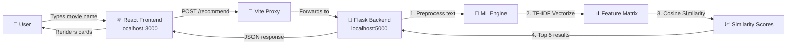

# 🎬 CineMatch — AI Movie Recommendation System

> A full-stack Netflix-style movie recommendation system powered by TF-IDF Vectorization & Cosine Similarity.

## 📹 Live Demo


---

## 🖼️ Screenshots

````carousel
### Landing Page


Dark theme with cinematic background, glassmorphism search bar, AI-Powered badge, and Quick Search trending chips.
<!-- slide -->
### Recommendation Results


5 movie cards with rank badges, similarity scores, genre tags, ratings, and genre-based gradient backgrounds.
<!-- slide -->
### How It Works + Footer


Educational 3-step section explaining TF-IDF + Cosine Similarity, plus tech stack footer.
````

---

## 🏗️ Architecture



---

## 📂 Project Structure

| File | Purpose |
|------|---------|
| [app.py](file:///c:/Users/HP/OneDrive/Desktop/movie_recomendation_system/backend/app.py) | Flask API server with TF-IDF engine |
| [movies_data.py](file:///c:/Users/HP/OneDrive/Desktop/movie_recomendation_system/backend/movies_data.py) | Curated 50-movie dataset |
| [requirements.txt](file:///c:/Users/HP/OneDrive/Desktop/movie_recomendation_system/backend/requirements.txt) | Python dependencies |
| [App.jsx](file:///c:/Users/HP/OneDrive/Desktop/movie_recomendation_system/frontend/src/App.jsx) | React app with all components |
| [App.css](file:///c:/Users/HP/OneDrive/Desktop/movie_recomendation_system/frontend/src/App.css) | Netflix-style component styles |
| [index.css](file:///c:/Users/HP/OneDrive/Desktop/movie_recomendation_system/frontend/src/index.css) | Global CSS design system |
| [vite.config.js](file:///c:/Users/HP/OneDrive/Desktop/movie_recomendation_system/frontend/vite.config.js) | Vite config with API proxy |
| [README.md](file:///c:/Users/HP/OneDrive/Desktop/movie_recomendation_system/README.md) | Full documentation |

---

## 🚀 How to Run

### Start Backend
```bash
cd backend
pip install -r requirements.txt
python app.py
# → Runs on http://localhost:5000
```

### Start Frontend
```bash
cd frontend
npm install
npm run dev
# → Runs on http://localhost:3000
```

---

## 🧠 ML Explanation: TF-IDF + Cosine Similarity

### TF-IDF (Term Frequency — Inverse Document Frequency)

Converts movie descriptions into numerical vectors:

| Term | TF (in doc) | IDF (across all docs) | TF-IDF Score |
|------|-------------|----------------------|--------------|
| "dream" | 0.08 | 3.91 | 0.313 |
| "heist" | 0.04 | 3.91 | 0.156 |
| "the" | 0.12 | 0.10 | 0.012 |

> [!TIP]
> Words that are **frequent in one document** but **rare overall** get the highest scores — making them the best discriminators for similarity matching.

### Cosine Similarity

Measures the angle between two TF-IDF vectors:
- **1.0** = Identical content
- **0.0** = Completely different
- Focuses on **direction** (content), not **magnitude** (length)

---

## ✨ Key Features

| Category | Features |
|----------|----------|
| **Backend** | TF-IDF with bigrams, cosine similarity, fuzzy search, autocomplete API, error handling with suggestions |
| **Frontend** | Dark Netflix theme, glassmorphism, autocomplete dropdown, genre-based card gradients, hover zoom effects, loading/error states |
| **UX** | Keyboard navigation, responsive design, smooth animations, educational "How It Works" section |

---

## 🔌 API Reference

| Method | Endpoint | Body/Params | Response |
|--------|----------|-------------|----------|
| `POST` | `/recommend` | `{"movie": "Inception"}` | Top 5 similar movies with scores |
| `GET` | `/movies` | — | All 50 movies |
| `GET` | `/movies/search?q=dark` | `q` param | Autocomplete matches |

---

> [!NOTE]
> Both servers must be running simultaneously. The Vite dev server proxies API calls to Flask automatically.
